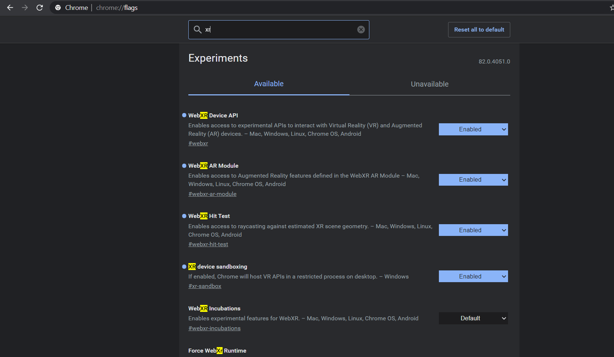

# Flashback2020

Flashback Conference WebXR Demo.

Slides: https://slides.com/aysegulyonet/flashback-2020

## Models

 - "[Church of St. Sofia](https://poly.google.com/view/13hUrQbMlAt)" by [CyArk Info](https://poly.google.com/user/4U4FhbhDQdR)

 


 - "[Thomas Jeferson Memorial](https://poly.google.com/view/3uHfaa5Kmki)"  by [CyArk Info](https://poly.google.com/user/4U4FhbhDQdR)

 


## Technology

* [three.js](https://threejs.org/): 3D library.
* [WebXR Device API](https://developer.mozilla.org/en-US/docs/Web/API/WebXR_Device_API): is a group of standards which are used together to support rendering 3D scenes to hardware designed for presenting virtual worlds (virtual reality, or VR), or for adding graphical imagery to the real world, (augmented reality, or AR). 
* [glTF](https://www.khronos.org/gltf/): 3D File format.

## Running Locally

1. Install dependencies

``` 
npm install
```

2. Get [Poly API](https://developers.google.com/poly/develop/api) key and add create a config.js as in config.example.js. Add your API key to apiKey string value.

``` js
var config = {
    apiKey: "Your Poly API key here!"
}
export {
    config
};
```

3. Start the server

``` 
npm start
```

4. Navigate to [http://localhost:4200/](http://localhost:4200/)

## Viewing on the browser

1. Download [Chrome Canary](https://www.google.com/chrome/canary/) or [Edge Canary](https://www.microsoftedgeinsider.com/en-us/download).

2. Enable WebXR experimental flags by navigating to [Chrome Flags](chrome://flags/) or [Edge Flags](edge://flags/).




## Other Resources

* [Mixed Reality Resources](http://bit.ly/MixedRealityResources)
* [Windows Mixed Reality Development](https://docs.microsoft.com/en-us/windows/mixed-reality/?WT.mc_id=flashback-github-ayyonet)
* [WebXR APIs](https://developer.mozilla.org/en-US/docs/Web/API/WebXR_Device_API)
* [ImmersiveWeb. Dev](https://immersiveweb.dev/)
